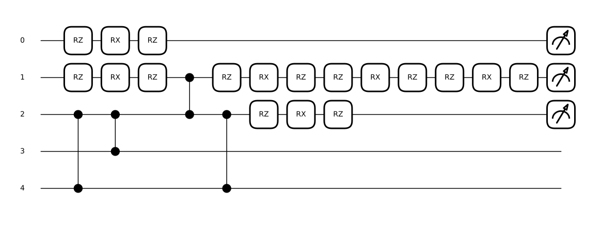
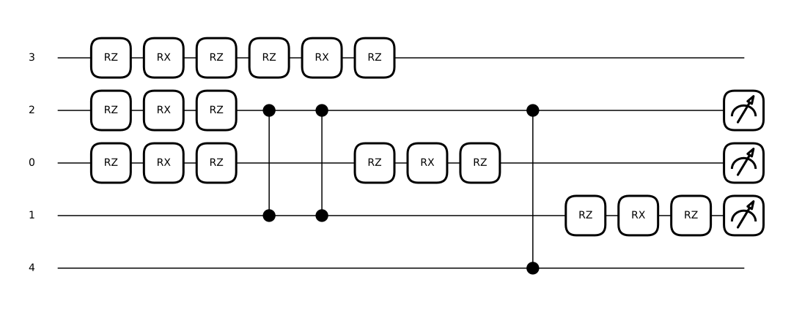
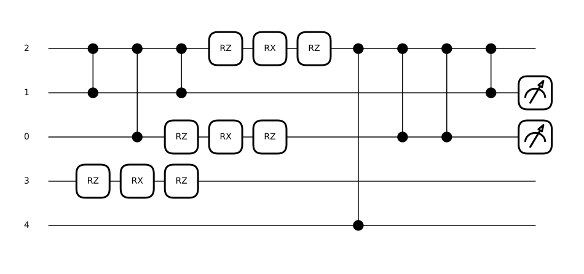
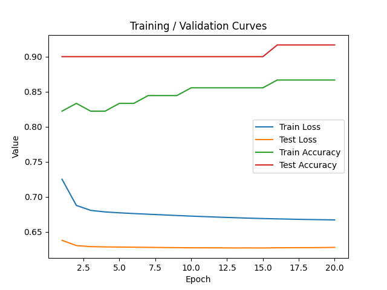
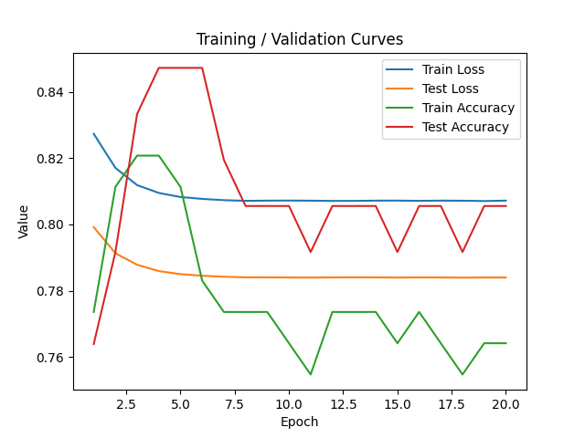
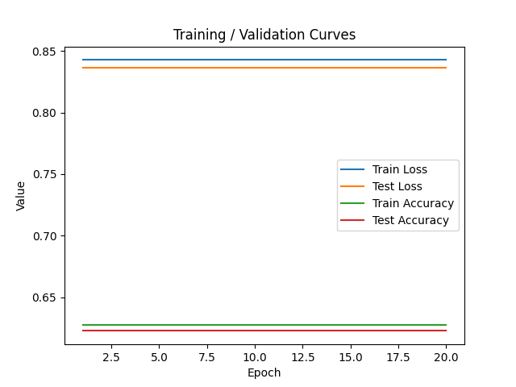
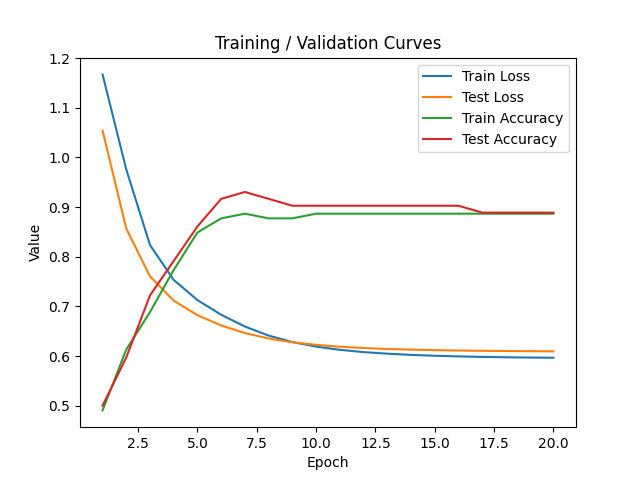
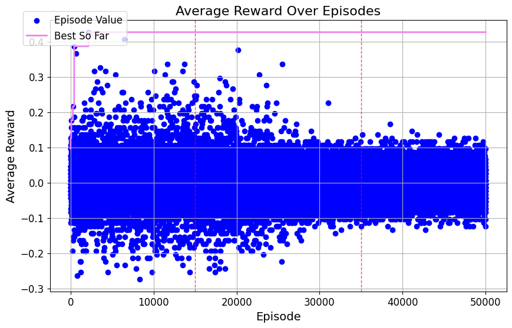
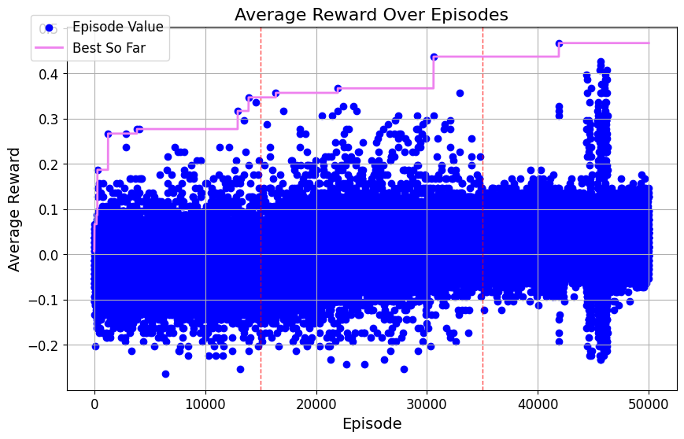
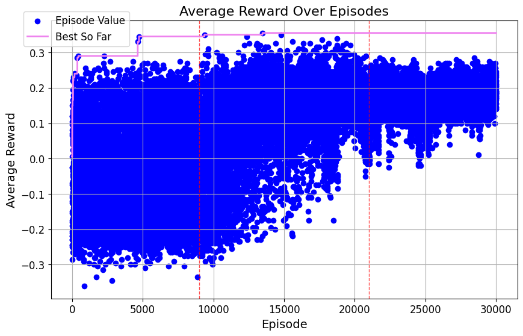

# Demonstration of Reinforcement Learning Assisted Automatic Quantum Circuit Structure Search for Quantum Machine Learning Classification.

*Classical machine learning (ML) models for classification task typically learn to map input features $x$ to output scores $f(x)$ (often interpreted as unnormalized probabilities), using ansatz function approximations such as neural networks. While effective in many domains, classical models are inherently limited by their computational space. In contrast, quantum computing leverages the exponential growth of the state space. An $n$-qubit system spans a Hilbert space of dimension $2^n$. Such exponential scaling offers a promising route to capture and process complex data patterns more efficiently and is an active area of research.*

Utilization of Reinforcement Learning (RL) for Parametrized Quantum Circuits (PQCs) creation is currently being explored in literature  [^ostaszewski] [^rl-architecture-search].
We have set a goal of implementing an search algorithm based on Reinforcement Learning (RL) capable of finding an efficient parametrized quantum circuit (PQC) structure; feasible for performing classification, while incorporating real hardware restictions like coupling map and built-in gate set. We tested approach on some toy datasets from the sklearn package.
<!-- We could also easily test obtained result on a real accesible quantum hardware but there is not time :( -->

## Supervised Quantum Machine Learning with PQCs

In supervised quantum ML, PQCs transform an initial state $|0\rangle^{\otimes n}$ using a unitary operator $U(x,\theta)$ that depends on both the classical input $x$ and tunable parameters $\theta$. 

We measure the expectation values of the Pauli $Z$ operator on the first $L$ qubits to obtain the score vector:
$$
f_i(x,\theta) = \langle 0|^{\otimes n} \, U^\dagger(x,\theta) \, Z^{(i)} \, U(x,\theta) \, |0\rangle^{\otimes n}, \quad \text{for } i=1,\dots,L.
$$
The predicted class is then given by:
$$
\hat{y} = \arg\max_{i} f_i(x,\theta).
$$

Similar framework is presented in [^sqml-framework].

It is important to note that the performance of the circuit highly depends on the chosen ansatz $U(x,\theta)$ and choice of trainable parameters $\theta$. Every unitary must be implemented as a sequence of simple gates from a *universal gate set* [^nielsen-chuang] that is hardware dependent. With current hardware length of circuit is severely limited by errors that quickly destroy information. We elaborate on real hardware limitations taking HelmiQ5 as example.

## Hardware Constraints on VTT Q5 "Helmi"

When implementing PQCs on real quantum hardware, we must respect the real-device constraints. On the Helmi quantum computer, only a specific set of native gates along with a specific coupling map is available. 
Helmi is built with a star-shaped topology a central qubit (QB3) is connected to all outer qubits (QB1, QB2, QB4, QB5), meaning that two-qubit interactions are only directly possible between QB3 and any outer qubit.
![HelmiQ5][fig:helmi]

Helmi natively implements:
- **Single-qubit gate:** the Phased-RX (PRX)
- **Two-qubit gate:** the Controlled-Z (CZ)

Any arbitrary unitary $U(x,\theta)$ must be decomposed into a sequence of these simple gates. However, arbitrary decomposition could lead to exponential overhead in the general case. 
 

Let's estimate practical circuit depth limitations due to the accumulation of errors, particularly from two-qubit gate infidelity. Numerical values refer to [^vtt2024]

 

### Fidelity Decay 
Following the simplest error model, assume *uncorrelated stochastic errors*, where the total circuit fidelity is given by[^vadali]:

$$
F_{\text{circuit}} \approx F_1^{N_1} F_2^{N_2}
$$

where:
- $ F_1 \approx 99\% $ is the fidelity of single-qubit gates.
- $ F_2 \approx 95\% $ is the fidelity of two-qubit CZ gates.
- $ N_1, N_2 $ are the numbers of single- and two-qubit gates, respectively.

  
This simplified approach yields **exponential fidelity decay** posing significant limitations on circuit depth. 
Some more advanced calculations on average fidelity on random PQCs support this claim [^zyczkowski-fidelity].

Since **two-qubit gates contribute dominantly to fidelity loss**, we solve a reasonable estimate :

$$
F_{\text{circuit}} \approx F_2^{N_2}.
$$

A practical threshold for meaningful computation is $F_\text{circuit} > 0.5$.

$$
N_2 < \frac{\log2(0.5)}{\log2(0.95)}  \approx 13.5.
$$

Thus, after approximately 14 two-qubit gates, fidelity drops below 50%, making the results unreliable.

<!--Since PQCs typically involve both single-qubit and two-qubit gates, assuming a roughly uniform distribution on typical circuit, we conclude that circuits on Helmi should be shallow circuit of ~20 total gates in total.-->

There is another important factor due to qubit relaxation times. 
However,  worst case scenario for middle Q3 qubit, with the worst decoherence time is $\approx 10\mu s$; and gates performances around $ 100-120 ns$ is still giving much softer limits on around 80 gates (while most of the qubits have higher times), so we can neglect it here.

## Reinforcement Learning for PQC Structure Search

### What is Reinforcement Learning?

Reinforcement Learning (RL) is a framework where an **agent** learns to make decisions by interacting with an **environment**. The agent chooses an **action**, receives a **reward**, and observes the new **state** of the environment. Over time, it aims to discover a **policy** that maximizes cumulative reward. 

![RL][fig:rl-loop]

This paradigm has been successfully applied to complex tasks, such as mastering Atari games from raw pixels — where agents trained purely via RL achieved human-level performance. [^atari]

In our case, we use RL to **automate the discovery of quantum circuits anzatz**, treating each gate placement as a decision made by the agent.

In this framework, building PQCs become a **sequential decision problem**, with neural network acting as agent exploring certain (partiallly observable) markov decision process. It shall be noted that 'choose random action' algorithm is a valid agent which can produce some good solutions. But with RL we aim to explore space in better way; to produce good solutions most of the time or find better one hardly achievable for random search. The latter is achived in simmilar work that appeard recenlty[^rl-architecture-search].

### RL Theory: Value Functions and the Bellman Equation

The common mathematical foundation of RL is the **Markov Decision Process (MDP)**, consisting of:

- **States** $s \in \mathcal{S}$
- **Actions** $a \in \mathcal{A}$
- **Transition probabilities** $P(s' \mid s, a)$
- **Reward function** $R(s,a,s')$
- **Discount factor** $\gamma \in [0,1]$

The **discount factor** $\gamma$ determines how much the agent values **future rewards** over immediate ones. A value close to 1 means long-term rewards are important; a smaller $\gamma$ makes the agent short-sighted.

To evaluate how good a strategy (policy) is, we define:

- **State-value function** $V^\pi(s)$: expected cumulative reward starting from state $s$ under policy $\pi$.
- **Action-value function** $Q^\pi(s,a)$: expected cumulative reward starting from state $s$, taking action $a$, and following policy $\pi$ afterward.

The **Bellman equations** recursively relate these with the values after transition. For the **optimal policy**, the **Bellman optimality equation** is:

$$
Q^*(s,a)= \sum_{s'} P(s'\mid s,a)\Bigl[R(s,a,s')+\gamma \max_{a'} Q^*(s',a')\Bigr]
$$

It expresses that the value of action $a$ in state $s$ equals the **immediate reward** plus the **best statistically expected future reward**, discounted by $\gamma$.

### Deep Q-Learning and PQC Optimization

We apply a **Deep Q-Network (DQN)** to learn the action-value function $Q(s,a)$ using a neural network. The network takes as input the current state of the quantum circuit, and outputs scores (Q-values) for each possible action (e.g., adding a PRX or CZ gate on random position).

States are encoded using a box-like integer representation, where each gate is mapped to a vector of integers describing its type and wiring.

The loss function is constructed based on the Bellman equation

$$
\mathcal{L}(\theta) = \left(Q(s,a;\theta) - \left[R + \gamma \max_{a'} Q(s',a';\theta^-)\right]\right)^2,
$$
for any step **except last one**, where we need to manually set future prediction to 0.

This loss function measures how far our current prediction is from the optimal value update — it's often referred to as the **temporal-difference error** in the literature. However in this version training would not be stable , and consecutive updates will be highly correlated.

Key techniques implemeneted in project are:

- **Experience Replay**: help breaking correlations by storing recent transitions and sampling them randomly when training.
- **Target Networks**: using a delayed copy of the network $\theta^-$ to provide stable target.
- **Exploration strategies**: such as **epsilon-greedy**, in which with some probability (than can be appropriately scheduled during training) random action is taken to improve exploration during training.

<!-- do i really need this section? --
!!!![add short desription of not implemented: moving threshold [^ostaszewski] , paralerization of RL training (multithreding and integration), double DQN, (conclude that in general final performace of ML is effect of many implemented improvements and heavy experimentation) ]

## What to be improved
While our vanilla DQN agent provides a solid proof-of-concept for automated PQC structure search, a number of advanced RL techniques— not contained in our implementation are potentially need improve performance, we shortly desribe s of them:

Moving threshold  [@ostaszewski]. 

Parallelized Experience Collectionmention that this optimization is very feasible to implement on lumi suitable for LUMI  with possibilities of multithreading on cpu or gpus  and even for multiple nodes simulation when in need to simulate more than few qubits. [text bf this] 

In practice, achieving state-of-the-art performance in ML requires a careful orchestration of many methods along with extensive experimentation on hyperparameter tuning and often code profiling. Testing and comparing these enhancements will bring us closer to fully automated, high-performance quantum circuit design.
-->

## Experiments on LUMI
In this experiment, we conduct a series of trials using three distinct toy datasets. Each dataset is stratifyly splited into train/test parts with ratio 60/40. Test dataset is keep away and only train part is fetch into simulation. Train part is further split the same way into training/validation set, where training part is used for circuit parameters optimization and validation to estimate accuracy of circuit determining scalar reward passed to agent. 
Our dataset used were:  *Iris* (150 samples, 4 features), *Wine* (178 samples, 13 features) and *Breast Cancer* (569 samples, 30 features).

In each episode, the environment resets the quantum circuit to the empty state, then for up to \$n\$ gates sequentially: (a) the agent selects an action, (b) we append the corresponding gate, (c) perform one epoch of gradient-based parameter tuning, and (d) measure validation accuracy to produce a scalar reward.&#x20;
&#x20;

Our parameterized quantum circuits grow one gate at a time, with each **action** in the agent’s action space corresponding to adding:

1. A **single-qubit Phased-RX** gate on one of the five HelmiQ5 qubits
2. A **two-qubit CZ** gate on one of 4 places

Phased-RX gate carries two unnkown parameters, one feature and one trainable parameter, which is optimized by a **single gradient descent step** (using PennyLane’s gradient API) before computing the circuit’s validation accuracy as the reward.

Training proceeds in three sequential phases which we chose to be around the same number of epoches.

- **Random benchmark**: for a fixed number of episodes, the agent picks every gate uniformly at random, building circuits up to the maximum length. All resulting transitions populate the initial replay buffer.

- **ε-Greedy learning:** we anneal ε linearly from 1.0 to 0.01, mixing exploration (random actions) with exploitation (choosing the highest-Q action) and updating the Deep Q-Network online after each episode (sampling from experience buffer).

- **Deterministic phase:**  the trained policy deterministically grows circuits (while still trying to learn); we record the final validation accuracy along with circuits from whole training and save rewards obtained by agent through whole training.

After whole training we take the best circuit architecture, than train it again on whole training dataset against test part separated at the start. 

## Results

Below we demonstrate some examples of circuit layouts that achieve good scores on previously separated test part (40% data), followed by training curves, and trace of architectures search.
A full RL reward trace is tucked into an appendix for readers interested in the agent’s learning behaviour.

### 1&nbsp;·&nbsp;Datasets and achived final test accuracy  

| Dataset        | #Samples | #Features | #Classes | Test Accuracy  |
|----------------|---------:|----------:|---------:|--------------:|
| Iris           | 150      | 4         | 3        | 0.91      |
| Wine           | 178      | 13        | 3        | 0.85          |
| Breast Cancer  | 569      | 30        | 2        | 0.62          |

*Table&nbsp;1 – Dataset statistics and the final test accuracy of the found circuits.*

---

### 2&nbsp;·&nbsp;Example circuits discovered  

| Dataset | Circuit diagram |
|---------|-----------------|
| **Iris** |  |
| **Wine** |  |
| **Breast-Cancer** |  |

*Table&nbsp;2 – Example circuit architectures getting high performance on toy dataset. Blocks of (RZ|RX|RZ) represent native phased-RX gate. Middle qubit is represented by 2->QB3*

---

### 3&nbsp;·&nbsp;Training / validation curves  

<!--

  
  
  

-->

*Fig.&nbsp;2 – Loss and accuracy during 20 epochs of parameter optimization on presented circuits with gradient descent. Iris, Wine, Breast Cancer, respectively.*

---

### 4&nbsp;·&nbsp; RL average-reward trace  

 
 
 
 

*Fig.&nbsp;3 – Episode-average rewards across all episodes; dashed lines separate random/e-greedy/deterministic phases. Note that while plot for breast cancer seems like improvement the found circuit perform the worse. The reason is probably subsumpling in training and validation which was used to speed up simulation.*

## Conclusions
**Automatic architecture search - even random - can be feasible.**
We demonstrated that automated, hardware‑aware architecture search can work. By incorporating HelmiQ5’s star topology and native CZ/PRX gate set directly in the action space, our RL‑driven search produces circuits executable on the device. State-vector simulations shows that even shallow circuits are supposed to solve simple tasks. This examples could potentially serve as **benchmark task** for current and near-term hardware. Some loss of accuracy is expected on the real chip, but QML models may show up - simmilar way as some ML models - natural tolerance to noise. Beside, with ML we usually satisfied with "good enough" solution.

**Computation cost is dominated by quantum simulation.** 
Training over 50000 epochs (which is not much in context of RL) requires 1-2 day on a single CPU. Upon profiling, computation time is dominated by quantum simulator; each epoch runs the circuit on every data point (≈200 for Iris), so a 10-gate *single episode* requires ≈2 000 state-vector simulations.  Scaling to larger qubit counts or deeper circuits will therefore require parallel experience collection and multi-GPU (or multi-node) distributed simulations, all of which LUMI’s architecture can support. 
<!-- Due to hardeness of quantum simulation first approach may be apporximation methods (mcmc ?, tensor networks?) -->
<!-- but small circuits up to soft boundary of 20 qubits does not benefit much as GPU speedup is killed by overheads, for small circuits default python non-optimized device is a good choice.
-possible project road -> pc simulation, cluster simulation, (scallable) qunatum at the end -->

**Check you quantum software**

We found that Pennylane backend simulator does not support vector-state distribution on multiple AMD-GPU, but only for Nvidia. We highligh importance of veryfing veryfing possibilities of software and integration with diffrent backend to provide backup backend in case of unpredicted problems.  

Next topic we would like to touch is containerization.
As lumi need to be efficient by many users minimal setup is available, contenarization provide a convinient solution for creating environment on HPC infrastructures and, while complicated to setup - can simplify workflow later. 
For example scheduling work in project required only setting few environmental variables and running proper sbatch script, all extra steps that are typically required for setup can be encapsulated witing container definition.  Moreover this  approach does not rely on software installed on lumi and can be customized for specific needs when providing high level of control with fake-sudo privilages. It is also feasible if software need to be compiled from source which may happen with maturing quantum software.

## Ackowledges
We thank Nicolaus Copernicus Astronomical Center of the Polish Academy of Sciences in Warsaw for providing early version of code.

## References
[^ostaszewski]: M. Ostaszewski *et al.*, “Reinforcement learning for optimisation of variational quantum circuit architectures”, [Link](https://arxiv.org/abs/2103.16089)  
[^rl-architecture-search]: F. Rapp *et al.*, “Reinforcement learning-based architecture search for quantum machine learning”, *Machine Learning: Science and Technology* **6** (1): 015041, 2025. [Link](https://doi.org/10.1088/2632-2153/adaf75)
[^sqml-framework]: N. A. Nghiem, S. Y.-C. Chen, and T.-C. Wei, “Unified framework for quantum classification,” *Physical Review Research*, 2021. [Link](https://journals.aps.org/prresearch/abstract/10.1103/PhysRevResearch.3.033056)
[^nielsen-chuang]: M. A. Nielsen and I. L. Chuang, *Quantum Computation and Quantum Information: 10th Anniversary Edition*, Cambridge University Press, 2010.
[^vadali]: Vadali, A., Kshirsagar, R., Shyamsundar, P. et al. Quantum circuit fidelity estimation using machine learning. Quantum Mach. Intell. 6, 1 (2024). https://doi.org/10.1007/s42484-023-00121-4
[^zyczkowski-fidelity]: N. S. Sáenz de Buruaga, R. Bistroń, M. Rudziński, R. M. C. Pereira, K. Życzkowski, and P. Ribeiro, “Fidelity decay and error accumulation in random quantum circuits,” *arXiv preprint* arXiv:2404.11444, 2024. [Link](https://arxiv.org/abs/2404.11444)
[^vtt2024]: “HelmiQ5 device specs,” VTT Quantum Computer Documentation, Dec. 17 2024 [Link](https://vttresearch.github.io/quantum-computer-documentation/helmi/).  
[^atari]: V. Mnih *et al.*, “Human-level control through deep reinforcement learning,” *Nature*, **518**, pp. 529–533, 2015. [Link](https://www.nature.com/articles/nature14236)

<!--Figures -->
[fig:helmi]: figures/helmi-topology.png 
[fig:rl-loop]: figures/rl-loop.png

