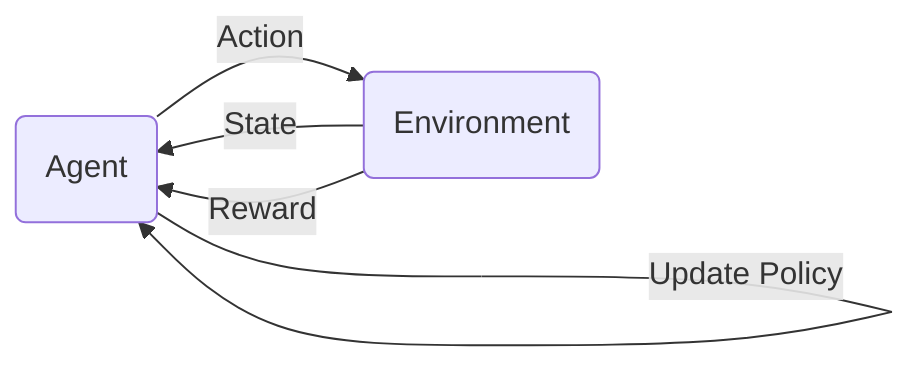

# RL4PQC

## Project Overview
This project was undertaken to investigate possibility of automatic creation of quantum circuits tailored for machine learning tasks with utilizing reinforcement learning techniques. The main thing is environment capable or run and evaluate diffrent architectures of quantum circuit.
It consist of three main components. The first is a sampler, responsible for generating and adjusting quantum circuits based on specific actions. The second component is a evaluator, which is used for evaluating given quantum circuit ansatz (circuit with placeholder untrained parameters). That evaluator, given ansatz and dataset, optimise trainable parameters and evaluate accuracy which is used for calculating reward. Finally it is all integrated in Environment class with simple step and reset api functions relevant from RL perspective.

Training and agent is also implemented but with basic pipeline - your own loop can be created or use with standard libraries if suitably adjusted step and reset function.


Visualization of reinforcement learning loop:

## Instalation and Usage
Clone the repository:

```bash
git clone ...
```

Navigate to the project directory:
```bash
cd RL4PQC/
```

### Make a test run
```
export CONFIG_PATH=config/config_template.yaml
export STORE_DIR=stashtest
export CONTAINER=mstepnia_RL4PQC.sif
sbatch --time 0:10:00 --job-name=testrun ./run_scripts/run_experiment.sh
```

or try inside singularity 
## EASY TESTING --------

```
singularity shell mstepnia_RL4PQC.sif  <-- Open singularity 
python3 run_scripts/rloop.py --config_file  config/config_template.yaml --store_directory stashtest
```

export STORE_DIR=RL4PQC_Results/big_actions_set
export CONTAINER=mstepnia_RL4PQC.sif


export CONFIG_PATH=config/iris.yaml
sbatch --time 30:00:00 --job-name=iris_big ./run_scripts/run_experiment.sh

export CONFIG_PATH=config/wine.yaml
sbatch --time 30:00:00 --job-name=wine_big ./run_scripts/run_experiment.sh

export CONFIG_PATH=config/breast.yaml
sbatch --time 30:00:00 --job-name=breast_big ./run_scripts/run_experiment.sh


export STORE_DIR=RL4PQC_Results/big_test_wine
export CONTAINER=mstepnia_RL4PQC.sif

export STORE_DIR=RL4PQC_Results/big_test_breast
export CONTAINER=mstepnia_RL4PQC.sif
sbatch --time 10:00:00 --job-name=breast_big ./run_scripts/run_experiment.sh

sbatch --time 30:00:00 --job-name=wine_big ./run_scripts/run_experiment.sh

Potential problems:

Dependencies should already be installed but leave this just in case:
```bash
pip install -r requirements.txt
```

Sometimes problem can happen and you need to somehow install a project in container.
```bash
python3 install -e .
``` preferred use 

or (less recommended)
```bash
python setup.py install
```


## To recreate plots with automatic crawler (run with container) 
```bash
python3 utils_plot/gen_plots.py  <folder path>
```