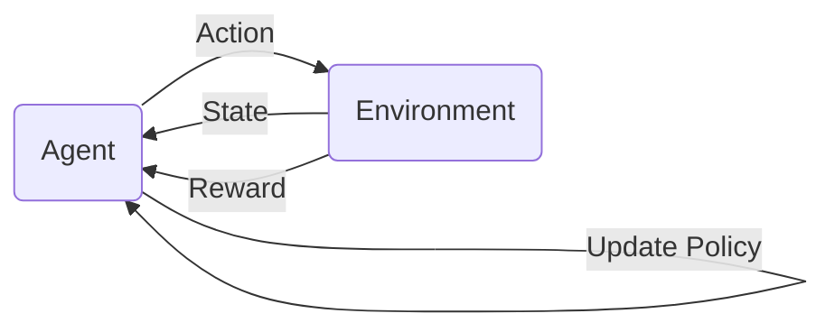

# RL4PQC

*A project for reinforcement learning assisted automation of discovering parametric quantum circuits (PQC)  that solve classical machine‑learning classification tasks on user‑defined quantum architecture with real restrictions.*

RL4PQC implements a Deep‑Q agent with a custom Gym environment that builds, trains and evaluates a quantum circuit on‑the‑fly (easily connectable for other pipelines and standard agent implementations through the OpenAI Gym package API). Over many episodes the agent learns which quantum gates to apply on which qubits, forming a problem-dependent architecture.


Visualization of the reinforcement learning loop.
---


## 1. Overall Pipeline

1. **Environment**

    After each agent action (choice of new gate) `QuantumCircuitEnv` executes a step yielding new **state** (represented as integer “box” encoding of the circuit) and **reward** (scalar function depending strongly on validation accuracy).

2. **Agent & Trainer**

    `DQNAgent` – feed‑forward Q-network with add-ons.

    `AgentTrainer` – orchestrates episodes, schedules exploration phases and updates the network.

3. **Circuit tools**

   *Architectures* specify quantum machine architecture: native gates, wires and couplings, also create action set. `RandomPQCGenerator` samples gates based on action and maintains the current circuit, while `PQCEvaluator` builds a pennylane quantum node from the circuit, optimizes trainable parameters and measure accuracy on validation set.

4. **Glue script – `rloop.py`**
   Command‑line entry point that loads a YAML config, prepares data, instantiates the env/agent/trainer, launches the RL search and finally train the best circuit architecture.

###  File‑by‑File Breakdown

| File                      | Main Class                       | Desription                                                        |
| ------------------------- | ------------------------------------------ | --------------------------------------------------------------------- |
| **architecture\_base.py** | `QuantumArchitecture`                      | Abstract base class for general operation on native gates, wires, coupling map; producing RL actions |
| **helmi5q.py**            | `HelmiArchitecture`                        | Helmi5Q architecture (Phased‑RX & CZ)                         |
| **pqcgen.py**             | `PQGSampler`, `RandomPQCGenerator`         | Sample and maintain the evolving quantum circuit                      |
| **pqceval.py**            | `PQCEvaluator`                             | Build QNode, optimize parameters, measure accuracy                       |
| **env.py**                | `QuantumCircuitEnv`                        | Gym‑style env governed by ****step()**** and ****reset()**** API. (State , action) → (next\_state, reward)                 |
| **agent.py**              | `ReplayBuffer`, `DeepQNetwork`, `DQNAgent` | DQN agent implementation                                               |
| **trainer.py**            | `AgentTrainer`                             | Run episodes, schedule exploration, collect rundata.                          |
| **rloop.py**              | `main`                                     | "One to rule them all"                     |

---


## 2. Installation and Usage
Clone the repository:

```bash
git clone ...
```

Navigate to the project directory:
```bash
cd RL4PQC/
```

### Basic workflow
Export environmental variables:
 CONFIG_PATH, STORE_DIR - folder for results, and CONTAINER - location, optionally AGENT_WEIGHTS to load initial weight from old experiments. The simplest  way it to keep weight and cointainer in repo to avoid problem with container binding.
 ```
export CONFIG_PATH=...
export STORE_DIR=...
export CONTAINER=...
export AGENT_WEIGHTS=... (optional)
```
It is recommened to use container provided by CSC.

To make a small test run:
```
export CONFIG_PATH=config/config_template.yaml; export STORE_DIR=<testrun>; export CONTAINER=<container>.sif
sbatch --time 0:10:00 --job-name=testrun ./run_scripts/run_experiment.sh
```

or try inside singularity (alternative for real-time lookup for developing and catching runtime errors):
```
singularity shell --bind $PWD $CONTAINER
python3 run_scripts/rloop.py --config_file  config/config_template.yaml --store_directory stashtest
```

To run larger experiment with current config files:
```
export CONFIG_PATH=config/iris.yaml
sbatch --time 30:00:00 --job-name=iris_big ./run_scripts/run_experiment.sh

export CONFIG_PATH=config/wine.yaml
sbatch --time 30:00:00 --job-name=wine_big ./run_scripts/run_experiment.sh

export CONFIG_PATH=config/breast.yaml
sbatch --time 30:00:00 --job-name=breast_big ./run_scripts/run_experiment.sh
```

Each run creates a timestamped folder under STORE_DIR that holds everything you need: a copy of the exact config, the best-found circuit with its trained parameters and accuracy, agent’s weights, reward/accuracy traces, a summary plots (raw data included), and a log file of the detailed run progress.

### 3. Further tweaking

#### Config
A minimal working file with brief description of each hyperparameter is available at config/config_template.yaml; copy it and tweak the fields.
That file serves only as quick test run. A truly “optimal” config schema will depend on ongoing experimentation, check the files for experiments too lookup for example config. Note that with extensive numbers of hyperparameters this is not easily achievable and training is resource-intensive. 

#### Plugging in a new quantum architecture
You can add your custom architecture creating a new class following the example in helmi5q.py. 
Generic action set can be created automatically. Some additional improvement in architecture ABC class could be done to tailor, for example, special subset of qubits and coupling map on Q50. 

#### Implementation of parallelization and GPU usage
LUMI architecture is suitable to speed up things with pararrel experience collection (CPU multithreading) or obligatory simulation speedup for larger circuits (diffrent pennylane device or whole diffrent backend would be needed for this)
